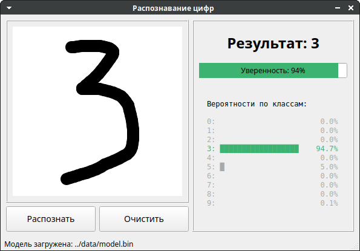
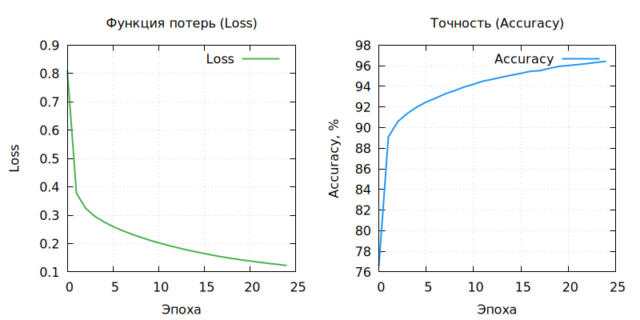

# Разработка и программная реализация многослойного перцептрона для задачи классификации рукописных цифр

## Цель
Разработать и обучить многослойный перцептрон на C++ без использования фреймворков машинного обучения.

Через практическую реализацию добиться глубокого понимания следующих алгоритмов и концепций:
- прямого и обратного распространения сигнала в нейронной сети;
- оптимизации параметров модели методом градиентного спуска;
- работы функций активации и расчёта функции потерь;
- обработки реальных данных (MNIST) в контексте обучения с учителем.

## Описание проекта
Проект представляет собой реализацию многослойного перцептрона (MLP) для классификации рукописных цифр из набора данных MNIST. Система включает два интерфейса взаимодействия и полностью написана на C++ без использования внешних ML‑библиотек.

## Структура проекта
```bash
    ├── app                         # Приложения
    │   ├── console_app             # Консольное приложение
    │   │   ├── CMakeLists.txt
    │   │   └── main.cpp
    │   └── gui_app                 # Графическое приложение (Qt)
    │       ├── CMakeLists.txt
    │       ├── drawingcanvas.cpp   # Холст для рисования
    │       ├── drawingcanvas.hpp
    │       ├── main.cpp
    │       ├── mainwindow.cpp      # Главное окно
    │       ├── mainwindow.hpp
    │       └── mainwindow.ui       # Интерфейс (Qt Designer)
    ├── CMakeLists.txt              # Корневой сценарий сборки
    ├── data                        # Данные MNIST и модели
    │   ├── model.bin               # Обученная модель
    │   ├── README.md               # Инструкция по скачиванию датасета
    │   ├── t10k-images-idx3-ubyte  # Тестовые изображения
    │   ├── t10k-labels-idx1-ubyte  # Тестовые метки
    │   ├── train-images-idx3-ubyte # Обучающие изображения
    │   └── train-labels-idx1-ubyte # Обучающие метки
    ├── docs                        # Документация приложения
    │   ├── plot.gnuplot            # Скрипт для построения
    │   ├── screenshot.png          # Скриншот главного окна GUI
    │   ├── training.log            # Логи обучения
    │   └── training_plot.png       # График обучения
    ├── lib                         # Библиотеки
    │   ├── matrix                  # Библиотека с матричными операциями
    │   │   ├── CMakeLists.txt
    │   │   ├── include
    │   │   │   └── matrix
    │   │   │       └── matrix.hpp  
    │   │   └── src
    │   │       └── matrix.cpp
    │   └── ml                      # Библиотека машинного обучения**
    │       ├── CMakeLists.txt
    │       ├── include
    │       │   └── ml
    │       │       ├── mnist_loader.hpp      # Загрузчик данных MNIST
    │       │       └── neural_network.hpp    # Класс NeuralNetwork
    │       └── src
    │           ├── mnist_loader.cpp
    │           └── neural_network.cpp
    ├── README.md                   # Документация проекта
    └── tests                       # Тесты
        ├── CMakeLists.txt
        ├── test_matrix.cpp         # Тесты матричной библиотеки
        ├── test_mnist_loader.cpp   # Тесты загрузчика данных
        ├── test_mnist.py           # Оценка точности на тестовой выборке (Python)
        └── test_neural_network.cpp # Тесты нейронной сети
```

## Данные

Для работы проекта необходимо скачать датасет MNIST и разместить файлы в директории `data/`.

Подробная инструкция: [data/README.md](data/README.md)

### Файлы моделей
Обученные модели сохраняются в директории `data/` в формате `.bin`.

## Требования

- **C++17** или выше
- **CMake 3.16+**
- **Google Test** (автоматическая загрузка через CMake)
- **Qt5/Qt6** (опционально, только для GUI приложения)

## Сборка и запуск

### Параметры сборки

| Флаг | Описание | По умолчанию |
|------|----------|--------------|
| `BUILD_TESTS` | Сборка unit-тестов | `OFF` |
| `BUILD_CONSOLE_APP` | Сборка консольного приложения | `OFF` |
| `BUILD_GUI_APP` | Сборка графического приложения | `OFF` |

### Базовая сборка (только библиотеки)
```bash
mkdir build && cd build
cmake ..
cmake --build . -j$(nproc)
```

### Сборка с тестами
```bash
mkdir build && cd build
cmake .. -DBUILD_TESTS=ON
cmake --build . -j$(nproc)
ctest --output-on-failure
```

### Сборка с консольным приложением
```bash
mkdir build && cd build
cmake .. -DBUILD_TESTS=ON -DBUILD_CONSOLE_APP=ON
cmake --build . -j$(nproc)
```

### Полная сборка (все компоненты)
```bash
mkdir build && cd build
cmake .. -DBUILD_TESTS=ON -DBUILD_CONSOLE_APP=ON -DBUILD_GUI_APP=ON
cmake --build . -j$(nproc)
```

## Использование

### Консольное приложение

Обучение модели:
```bash
./app/console_app/mnist_console train <data_dir> <model_path> [epochs] [lr]

# Пример
./app/console_app/mnist_console train ../data ../data/model.bin 25 0.0001
```

Предсказание цифры по изображению:
```bash
./app/console_app/mnist_console predict <model_path> <image_path>

# Пример
./app/console_app/mnist_console predict ../data/model.bin digit.pgm
```

### GUI приложение
```bash
./app/gui_app/mnist_gui
```

#### Главное окно



*Интерфейс: холст для рисования слева, результат и вероятности справа*

## Оценка точности

Для проверки точности модели на тестовом датасете используйте Python скрипт:

```bash
cd build
python3 ../tests/test_mnist.py
```
Скрипт извлекает изображения из тестового датасета MNIST, сохраняет их как PGM, выполняет предсказание и выводит процент правильных ответов.

## Результаты обучения

| Параметр | Значение |
|----------|----------|
| Архитектура | 784 → 64 → 32 → 10 |
| Функции активации | ReLU, Softmax |
| Параметров | 52 650 |
| Количество эпох | 25 |
| Скорость обучения (learning rate) | 0.0001 |
| Размер батча | 64 |
| Точность на обучении | 96.43% |
| Точность на тесте (10 000 примеров) | 96.05% |
| Функция потерь | 0.123 |

### Кривые обучения



## Матрица ошибок (**Confusion Matrix**)

Матрица ошибок на тестовой выборке (10 000 примеров):

|   | 0 | 1 | 2 | 3 | 4 | 5 | 6 | 7 | 8 | 9 | Всего |
|---|:--:|:--:|:--:|:--:|:--:|:--:|:--:|:--:|:--:|:--:|:--:|
| **0** | 968 | | | 1 | | 4 | 3 | 1 | 2 | 1 | 968/980 |
| **1** | | 1113 | 4 | 3 | | 1 | 3 | 2 | 9 | | 1113/1135 |
| **2** | 8 | 1 | 974 | 7 | 3 | 1 | 12 | 8 | 17 | 1 | 974/1032 |
| **3** | | | 5 | 977 | 1 | 3 | 1 | 8 | 12 | 3 | 977/1010 |
| **4** | 1 | | 6 | | 934 | 1 | 7 | 2 | 4 | 27 | 934/982 |
| **5** | 9 | 1 | 2 | 14 | 2 | 849 | 2 | | 6 | 7 | 849/892 |
| **6** | 9 | 3 | 1 | 1 | 5 | 10 | 923 | | 6 | | 923/958 |
| **7** | 3 | 8 | 13 | 7 | 1 | 1 | | 970 | 2 | 23 | 970/1028 |
| **8** | 5 | 1 | 1 | 10 | 3 | 3 | 4 | 5 | 939 | 3 | 939/974 |
| **9** | 6 | 7 | 1 | 10 | 12 | 2 | 1 | 8 | 4 | 958 | 958/1009 |

По диагонали — количество правильных предсказаний.  
Основные ошибки: 5↔3, 9↔4, 7↔9, 2↔8.

## План разработки
- [x] **Этап 1**: Структура проекта
- [x] **Этап 2**: Матричная библиотека с тестами
- [x] **Этап 3**: Библиотека нейронной сети с тестами
- [x] **Этап 4**: Консольное приложение
- [x] **Этап 5**: Графическое приложение

## Лицензия
Проект распространяется под лицензией MIT. <br>
**Автор**: [Дмитрий Казначеев](https://github.com/dmitriy-kaznacheev)
